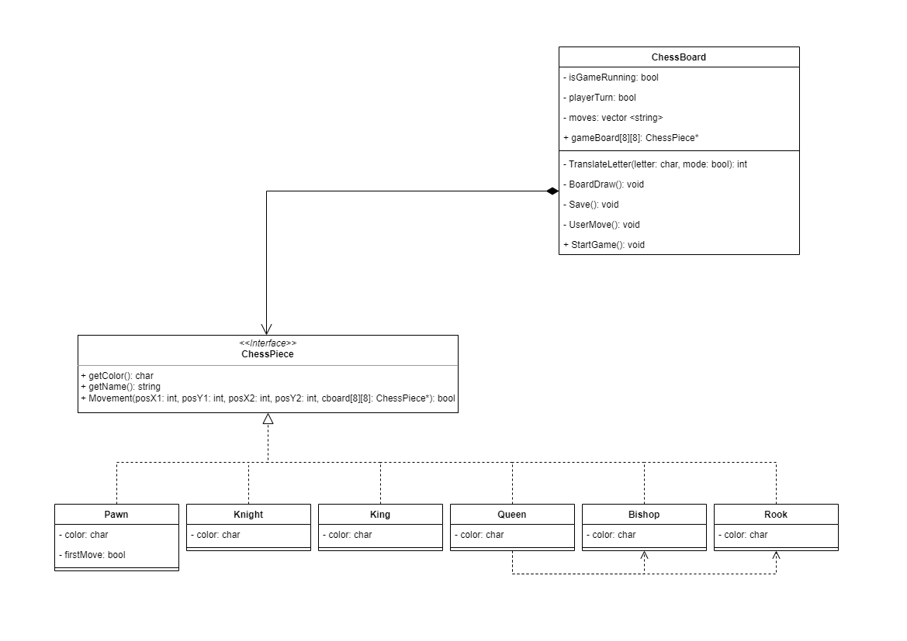
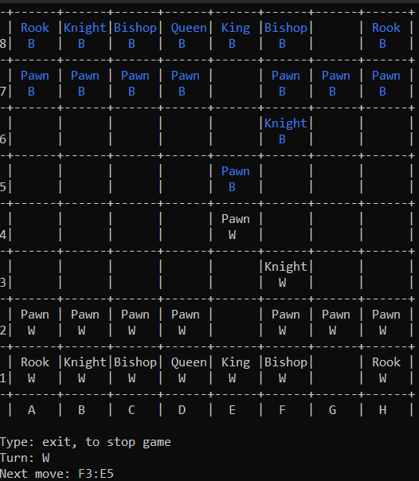

# Cpp terminal 

A simple player-vs-player chess game written in c++
## Known Bugs:

- No checkmate Rule, if you lose or win you will need to close the game (or type "exit")
- No Pawn Promotion Rule
 - No Enpesant Pawn Rule
## UML diagram:

## Screenshots:

